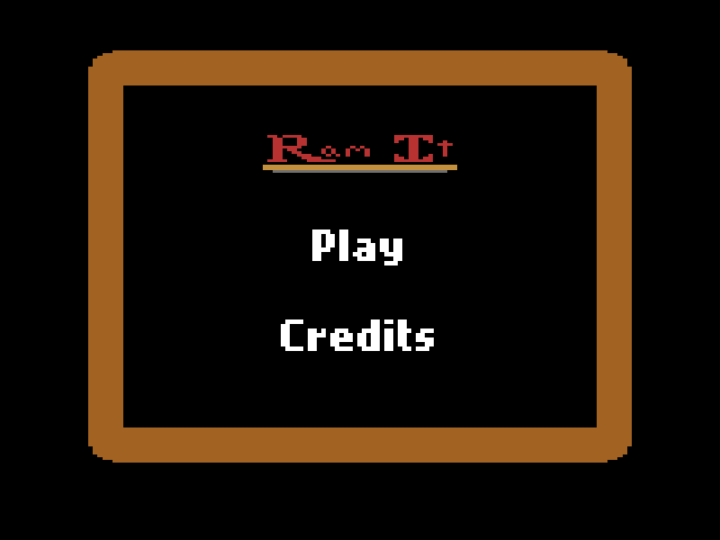
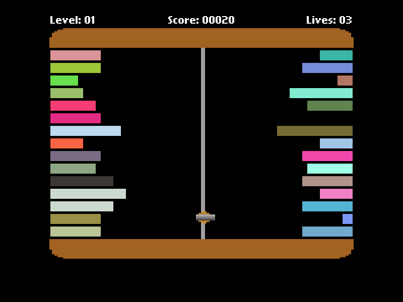
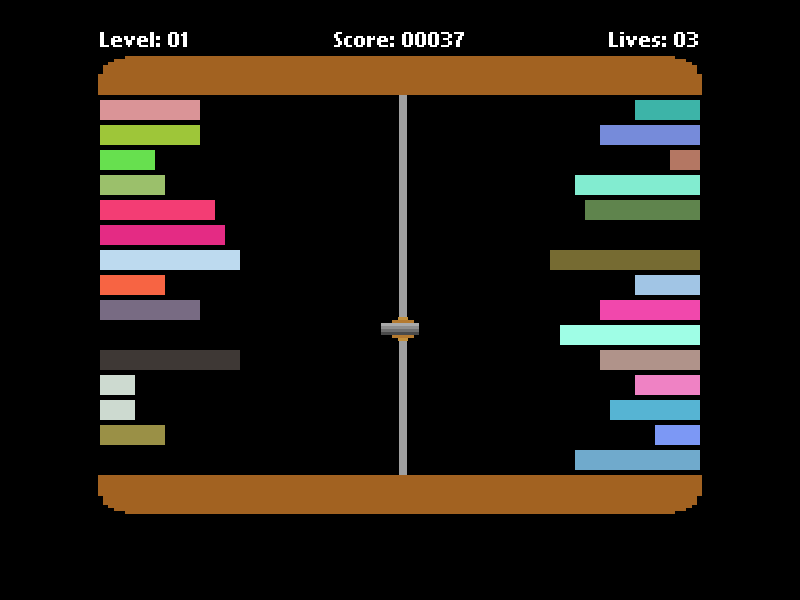
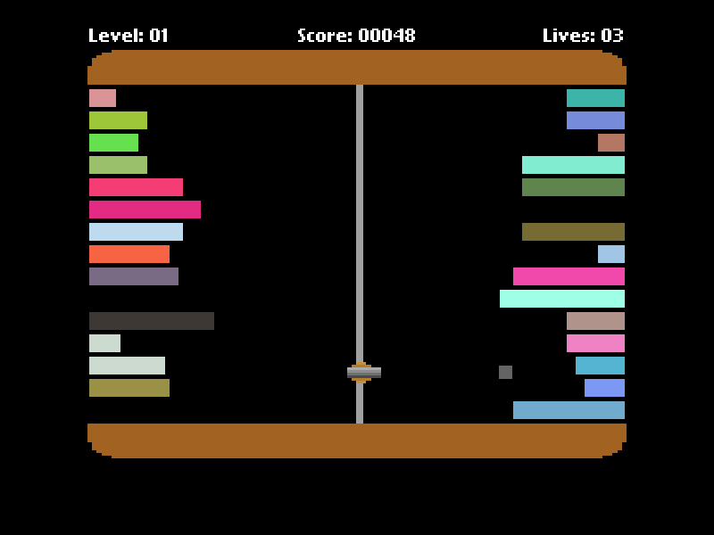

{!HTMLSTART!}
{!NAVIGATIONBAR!}

# Game RamIt


<!-- ####################################################################### -->
<!-- ####################################################################### -->

## Intro

```Game_RamIt``` is a small _"quasi"_-remake of the Telesys Ram It.   

We hope that you enjoy this litte game ;D

It is **FREE SOFTWARE**, so you are **very** welcome to hack and share it.


<!-- ####################################################################### -->
<!-- ####################################################################### -->

## Dedication

This game is dedicated to folks at [APAE](https://www.apaebrasil.org.br) 
that are doing a **great** job helping people that needs.   

Take a 5 min break, take a look their site and find a way to help them :D

Thanks! 


<!-- ####################################################################### -->
<!-- ####################################################################### -->

## Downloads

### Binary pagackes:

* Linux x64 - [Download](./downloads/linux_x64_v0_1_0.zip)

<!-- * Linux x86 - [Download](./downloads/linux_x86_v0_1_0.zip)  -->
<!-- * OSX x64   - [Download](./downloads/osx_x64_v0_1_0.zip) -->


### Source packages:

* zip    - [Download](./downloads/source_v0_1_0.zip)
* tar.gz - [Download](./downloads/source_v0_1_0.tar.gz)


## Screenshots
<a href="./img/1.png">  </a>
<a href="./img/2.png">  </a>
<a href="./img/3.png">  </a>
<a href="./img/4.png">  </a>


## Links

* [Blog Posts](./posts/)
* [All Downloads](./downloads/)
* [Gihub Page](https://www.github.com/AmazingCow-Game/Game_RamIt/)


{!FOOTER!}
{!HTMLEND!}
